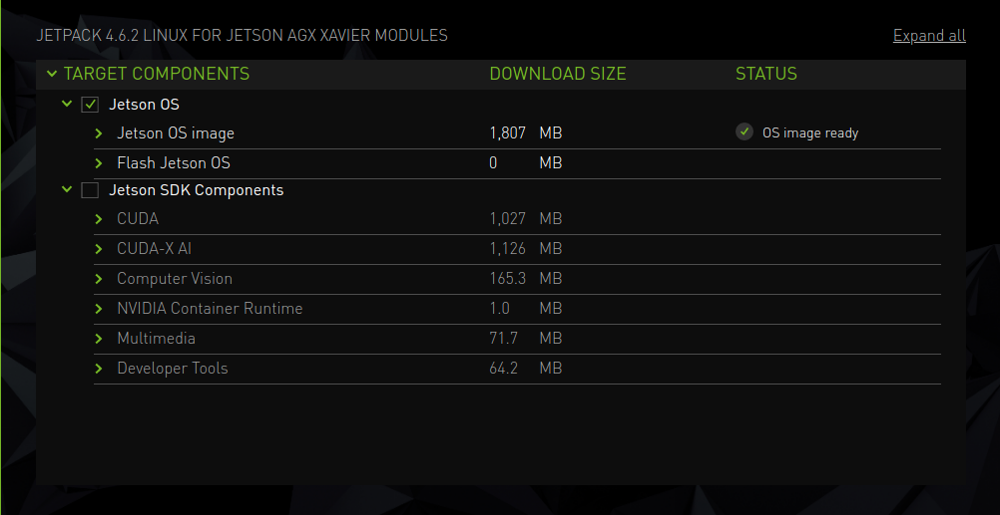
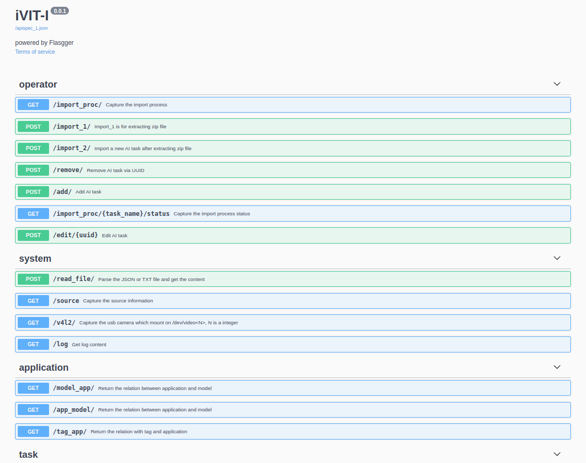

# iVIT-I For Jetson
iVIT-I for NVIDIA Jetson platform

* [Pre-requirements](#pre-requirements)
* [Prepare Environment](#prepare-environment)

# Pre-requirements
* JetPack 5.0.2+ ( without CUDA is okay! )
    
* nvidia-container2
    ```bash
    sudo apt-get update && sudo apt-get install -yq nvidia-docker2
    ```

# Prepare Environment

1. Clone Repository

    ```bash
    git clone https://github.com/InnoIPA/ivit-i-jetson.git && cd ivit-i-jetson
    ```

    * Clone specificall branch
        ```bash
        VER=r1.0.3
        git clone --branch ${VER} https://github.com/InnoIPA/ivit-i-jetson.git && cd ivit-i-jetson
        ```

2. Run the docker container with web api


    * Run container with **web api**
        ```bash
        ./docker/run.sh
        ```

    * Run container with **command line mode**
        ```bash
        ./docker/run.sh -c
        ```

    * Run container without initialize sample
        ```bash
        ./docker/run.sh -nc

        # if you need to initialize samples
        ./init_samples.sh

        # if you need to launch web api
        ./exec_web_api.sh
        ```

    * Run docker container step by step for developer

        Here is the [documentation](docs/activate_env_for_developer.md) explaining the workflow of `build docker image` and `run docker container`.

# Fast Testing
We provide the fast-test for each sample, please check [here](./test/README.md).

# Web API
<details>
    <summary>
        We recommand <a href="https://www.postman.com/">Postman</a> to test your web api , you could see more detail in <code>{IP Address}:{PORT}/apidocs</code>.
    </summary>
    
    
</details>
<br>

# Reference
- Using [tensorrt_demos](https://github.com/jkjung-avt/tensorrt_demos) to get tensorrt C++ api to fit the darknet model.
